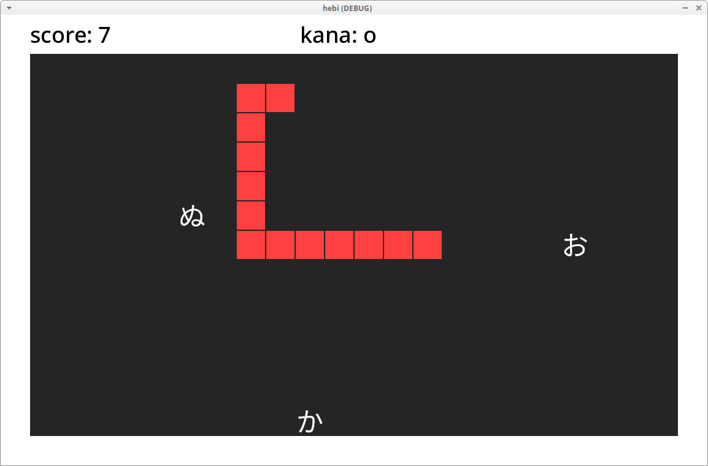

# Snake, but for practicing hiragana

Small variation on top of my first godot project (https://github.com/mkacik/godot-snek). It's a snake game, but instead of apple you need to pick up correct hiragana character based on what the top of screen bar tells ya. Get the wrong one and it's game over.

I didn't account in the code for edge cases like bad letter materializing right in front of you, or correct letter being locked in the corner by two "decoys".

If you're on desktop site, game is playable here: https://mkacik.github.io/godot-hebi/. I don't know yet how to do mobile controls, so not playable on mobile, maybe one day.

